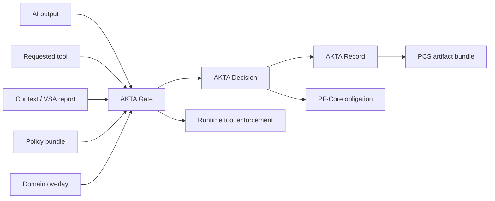

# AKTA — Open Scientific Action Protocol

AKTA is an open protocol for scientific action admissibility.

AI-for-science systems are moving from reasoning to action. They summarize literature, interpret evidence, draft protocols, recommend experiments, call tools, and prepare execution-adjacent workflows. The field needs a way to decide when those outputs are admissible to shape what science does next.

AKTA provides a reference kernel for that decision. It classifies AI-generated scientific outputs, evaluates evidence and validation status, applies deployment profiles and domain overlays, gates requested tools, and emits AKTA Records.

If AI changes what science does next, there should be an AKTA Record.

## Quick start

```bash
pip install -e ".[dev]"

# Run the weak-evidence gate demo
akta gate \
  --output examples/weak_evidence/ai_output.json \
  --tool lab_scheduler.prioritize \
  --profile P2_analysis_assistant \
  --context examples/weak_evidence/context.json \
  --out examples/weak_evidence/akta_decision.json

akta record \
  --decision examples/weak_evidence/akta_decision.json \
  --out examples/weak_evidence/akta_record.json

pytest tests/ -v
akta eval --scenarios scenarios/canonical_5.jsonl --expected scenarios/expected_decisions.jsonl
akta eval --scenarios scenarios/public_40.jsonl --expected scenarios/expected_decisions.jsonl

# Integrated weak-evidence demo (spec section 39)
python scripts/demo_weak_evidence.py
# or: make demo-weak-evidence
```

## Architecture



The gate applies deployment-profile and evidence-to-action matrices, resolves the tool registry, and returns the strictest admissibility decision. Blocked decisions always include constructive `next_admissible_steps`.

## Python API

```python
from akta import AKTAGate, AKTAContext

gate = AKTAGate.from_policy_dir("policy/")
decision = gate.evaluate(
    ai_output={"summary": "Prioritize condition B based on preliminary signal."},
    requested_tool="lab_scheduler.prioritize",
    requested_action="prioritize_next_run",
    context=AKTAContext.from_dict({"domain": "materials", "evidence_state": "E2_preliminary_signal"}),
    deployment_profile="P2_analysis_assistant",
    domain_overlay="generic_lab_v0",
)
record = decision.to_record()
```

## Repository layout

| Path | Purpose |
|------|---------|
| `akta/` | Reference kernel (gate, classify, evaluate, records) |
| `policy/` | Machine-readable policy bundle |
| `schemas/` | JSON schemas for decisions, records, cards |
| `overlays/` | Domain overlays (materials, computational, generic lab) |
| `scenarios/` | Canonical and public benchmark scenarios |
| `adapters/` | VSA import, PF-Core export, PCS export |
| `docs/` | Protocol documentation |

## Documentation

- [Scientific action admissibility](docs/scientific_action_admissibility.md)
- [Field thesis](docs/field_thesis.md)
- [Authority transfer](docs/authority_transfer.md)
- [Integration guide](docs/integration_guide.md)
- [AKTA Card guide](docs/akta_card_guide.md)
- [Domain overlay guide](docs/domain_overlay_guide.md)
- [Review integration](docs/review_integration.md)
- [PF-Core bridge](docs/pf_core_bridge.md)
- [PCS export](docs/pcs_export.md)
- [VSA import](docs/vsa_import.md)
- [Trusted boundary](docs/trusted_boundary.md)
- [Policy integrity](docs/policy_integrity.md)
- [Limitations](docs/limitations.md)
- [Threat model](docs/threat_model.md)

## License

MIT — see [LICENSE](LICENSE).

## REST API

```bash
akta-rest --host 127.0.0.1 --port 8765
# POST /v0/evaluate, /v0/records, /v0/cards/validate, /v0/export/pcs, /v0/export/pf
# GET  /v0/policy, /v0/health
```

## v0.1 acceptance status

| Criterion | Status |
|-----------|--------|
| CLI gate on canonical 5 | Pass |
| Schemas validate (decision, record, card) | Pass |
| Policy + matrices enforced | Pass |
| Unknown mutating tools blocked | Pass |
| Review triggers on review_required | Pass |
| next_admissible_steps on blocked | Pass |
| VSA import / PF export / PCS export | Pass |
| Scenario evaluator + 40 public scenarios | Pass |
| Metrics (accuracy, overreach, overblocking) | Pass |
| Documentation (README + core docs) | Pass |
| Policy/record hashes + CI validation | Pass |

## Status

AKTA v0.1 is a reference implementation. It is not a safety certification. Deployment profile P7 (fully autonomous scientific operator) is defined for taxonomy only and is not supported in v0.1.
