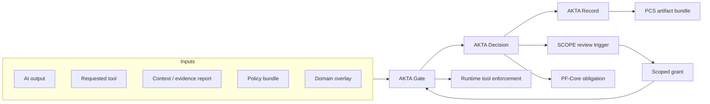

<p align="center">
<pre align="center">
###########################
    _    _  _______  _    
   / \  | |/ /_   _|/ \   
  / _ \ | ' /  | | / _ \  
 / ___ \| . \  | |/ ___ \ 
/_/   \_\_|\_\ |_/_/   \_\
###########################
</pre>
</p>

<p align="center"><strong>Open Scientific Action Protocol</strong></p>

<p align="center"><em>Open protocol for deciding when AI-generated scientific outputs are admissible to shape what science does next</em></p>

[](LICENSE)
[](https://www.python.org/downloads/)
[](https://github.com/fraware/AKTA/actions/workflows/ci.yml)
[](https://github.com/fraware/AKTA/actions/workflows/release-gate.yml)

---

## Why AKTA exists

AI-for-science systems are moving from reasoning to action. They summarize literature, interpret evidence, draft protocols, recommend experiments, call lab tools, and prepare execution-adjacent workflows. The hard question is no longer whether the model can produce an output — it is whether that output should be allowed to change what science does next.

Most stacks treat this as a model-quality or prompt-engineering problem. AKTA treats it as a **governance boundary**: classify the proposed action, evaluate the evidence behind it, apply deployment policy, gate requested tools, and emit a durable record of the decision. Integrators can wire that boundary into evidence pipelines, human review, runtime proof, and release packaging without pretending the model alone is sufficient.

> If AI changes what science does next, there should be an AKTA Record.

AKTA is a **reference implementation** of that protocol — not a safety certification, not a substitute for institutional review, and not a guarantee of scientific correctness.

---

## How it works



The gate classifies what the AI is trying to do, checks evidence and deployment policy, resolves the tool registry, and returns the strictest admissibility outcome. Blocked decisions include constructive `next_admissible_steps`. When human review authorizes a narrower scope, AKTA re-evaluates with that grant — it never broadens authorization on its own, and review grants do not override weak-evidence or profile policy by default. See [authority transfer](docs/authority_transfer.md).

---

## Quick start

Install the reference kernel (Python 3.10+):

```bash
git clone https://github.com/fraware/AKTA.git
cd AKTA
pip install -e ".[dev]"
```

Run the canonical **weak-evidence block** example — preliminary signal, mutating lab tool, decision blocked:

```bash
akta gate \
  --output examples/weak_evidence/ai_output.json \
  --tool lab_scheduler.prioritize \
  --profile P2_analysis_assistant \
  --context examples/weak_evidence/context.json \
  --out examples/weak_evidence/akta_decision.json
```

Expected outcome (abbreviated):

```json
{
  "admissibility": "blocked",
  "decision_reason": "Evidence E2_preliminary_signal ... exceeds limit for resource prioritization.",
  "blocked_tools": ["lab_scheduler.prioritize", "robot_queue.submit", "..."],
  "next_admissible_steps": [
    "downgrade to hypothesis discussion",
    "draft a validation experiment",
    "request domain review before prioritization",
    "gather additional evidence"
  ],
  "record_required": true
}
```

Generate the durable record from the decision:

```bash
akta record \
  --decision examples/weak_evidence/akta_decision.json \
  --out examples/weak_evidence/akta_record.json
```

For the full integrated chain (evidence import through packaging), see [examples/integrated_weak_evidence](examples/integrated_weak_evidence/) and `python scripts/demo_integrated_weak_evidence.py`.

---

## What you get

Every gate evaluation produces structured artifacts you can store, audit, and hand to downstream systems:

| Output | What it is |
|--------|------------|
| **AKTA Decision** | Admissibility verdict, blocked/allowed tools, rationale, and constructive next steps |
| **AKTA Record** | Durable, hash-linked record suitable for provenance and replay |
| **Review trigger** | Packet for human review when authorization or domain review is required |
| **PF-Core obligation** | Runtime proof obligation describing what must be demonstrated before execution |
| **PCS bundle** | Versioned artifact bundle for release and cross-system verification |

REST API, MCP server, and batch evaluation are available for integrators — see [Integration guide](docs/integration_guide.md) and [OpenAPI spec](adapters/generic_rest/openapi.yaml).

---

## Integration at a glance

| System | Role in the AKTA stack | Learn more |
|--------|------------------------|------------|
| **VSA** | Imports structured evidence reports into AKTA context | [VSA import](docs/vsa_import.md) |
| **SCOPE** | Human review and scoped authorization after a trigger | [SCOPE bridge](docs/scope_bridge.md) · [Live conformance](docs/scope_live_conformance.md) |
| **PF-Core** | Runtime proof obligations tied to admissibility decisions | [PF-Core bridge](docs/pf_core_bridge.md) |
| **PCS** | Packages decisions, records, and hashes for release verification | [PCS export](docs/pcs_export.md) |

SCOPE connects in several modes — offline simulation (default), Python import from a sibling checkout, subprocess CLI, or a one-shot review command (`scope akta review` requires both AKTA trigger and record). Reconstructable cross-repo demo: `make demo-reconstructable-cross-repo` then `make verify-reconstructable-cross-repo`. Details: [scope_live_conformance.md](docs/scope_live_conformance.md).

Cross-repo environment variables for optional CI jobs: [.github/CROSS_REPO_CI.md](.github/CROSS_REPO_CI.md).

---

## For contributors

We welcome contributions that sharpen the admissibility boundary — scenarios, domain overlays, adapters, docs, and tests. You do not need to be a policy expert to improve examples, fix edge cases, or extend integration paths.

**Set up a dev environment:**

```bash
pip install -e ".[dev,security]"
make ci
```

`make ci` runs the full local check suite (tests, policy validation, scenario evals). Run `pytest tests/ -v` for a faster loop while iterating.

**Good places to start:**

| Area | Where to look |
|------|----------------|
| Scenarios and evals | `scenarios/`, `evals/`, `tests/` |
| Domain overlays | `overlays/`, [domain overlay guide](docs/domain_overlay_guide.md) |
| Adapters (VSA, SCOPE, PF, PCS, REST, MCP) | `adapters/` |
| Documentation | `docs/` — especially [integration guide](docs/integration_guide.md) and [scientific action admissibility](docs/scientific_action_admissibility.md) |

Read [CONTRIBUTING.md](CONTRIBUTING.md) for pull-request expectations, [GOVERNANCE.md](GOVERNANCE.md) for protocol stewardship, and [docs/RELEASE.md](docs/RELEASE.md) for release verification. Be respectful, precise, and evidence-oriented — AKTA governs claim-to-action transitions, and contributions should preserve that boundary.

---

## Documentation

### Getting started

- [Scientific action admissibility](docs/scientific_action_admissibility.md) — protocol overview
- [Field thesis](docs/field_thesis.md) — problem framing
- [Integration guide](docs/integration_guide.md) — wiring AKTA into your stack
- [AKTA Card guide](docs/akta_card_guide.md) — institutional disclosure artifact

### Integration

- [Review integration](docs/review_integration.md)
- [SCOPE bridge](docs/scope_bridge.md) · [Live SCOPE conformance](docs/scope_live_conformance.md)
- [PF-Core bridge](docs/pf_core_bridge.md) · [PCS export](docs/pcs_export.md) · [VSA import](docs/vsa_import.md)
- [AKTA v0.3 integration summary](docs/akta_v03_integration.md)

### Policy and security

- [Policy integrity](docs/policy_integrity.md) · [Domain overlay guide](docs/domain_overlay_guide.md)
- [Trusted boundary](docs/trusted_boundary.md) · [Threat model](docs/threat_model.md)
- [Authority transfer](docs/authority_transfer.md) · [Limitations](docs/limitations.md)
- [Security policy](SECURITY.md)

### Evaluation

- [Scenario labeling guidelines](docs/scenario_labeling_guidelines.md)
- [Holdout private governance](docs/holdout_private_governance.md)
- Version history and release criteria: [CHANGELOG.md](CHANGELOG.md) · [docs/RELEASE.md](docs/RELEASE.md)

---

## Project status

**v1.0.0** (`akta-protocol`) is the current reference kernel on `release/v1.0`.

| Claim | What CI proves | What requires local siblings |
|-------|----------------|------------------------------|
| Reference kernel + policy v1.0 | `make ci` on every PR (359+ tests, evals, demos) | — |
| AKTA-Bench v1 | `make eval-bench-v1` in release-gate (105 oracle scenarios, holdout, behavioral middleware) | — |
| Live SCOPE pilot gate | Release-gate clones public SCOPE and runs python-import + pilot bundle | SCOPE CLI / akta-review modes need `scope` on runner |
| PF / PCS / VSA / Memory / PCS-Bench matrix | Release-gate sibling job when clone URLs or `*_REPO_PATH` vars set | Full matrix locally: `python scripts/verify_v1_release.py` |

Biology, chemistry, and clinical domain overlays remain experimental unless upgraded to institutional or expert-reviewed tiers. P7 autonomous operator profiles are taxonomy-only and refused at runtime. AKTA is a reference implementation — not a safety certification. See [docs/limitations.md](docs/limitations.md) and [docs/PROTOCOL_v1.0.md](docs/PROTOCOL_v1.0.md).

---

## License

MIT — see [LICENSE](LICENSE).
