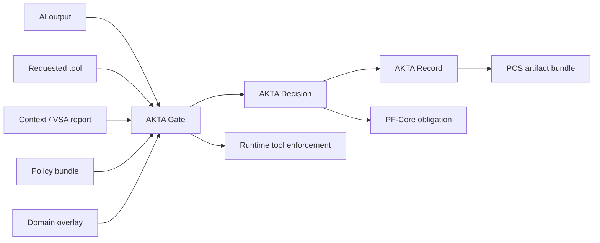

# AKTA — Open Scientific Action Protocol

AKTA is an open protocol for scientific action admissibility.

AI-for-science systems are moving from reasoning to action. They summarize literature, interpret evidence, draft protocols, recommend experiments, call tools, and prepare execution-adjacent workflows. The field needs a way to decide when those outputs are admissible to shape what science does next.

AKTA provides a reference kernel for that decision. It classifies AI-generated scientific outputs, evaluates evidence and validation status, applies deployment profiles and domain overlays, gates requested tools, and emits AKTA Records.

If AI changes what science does next, there should be an AKTA Record.

## Quick start

```bash
pip install -e ".[dev]"

# Dev mode (default): policy manifest optional; experimental overlays allowed
akta gate \
  --output examples/weak_evidence/ai_output.json \
  --tool lab_scheduler.prioritize \
  --profile P2_analysis_assistant \
  --context examples/weak_evidence/context.json \
  --out examples/weak_evidence/akta_decision.json

# Production mode: requires policy manifest + deployment HMAC key
# $env:AKTA_PRODUCTION_MODE = "1"
# $env:AKTA_POLICY_HMAC_KEY = "<deployment-secret>"
# Regenerate manifest after policy edits:
python scripts/regenerate_policy_manifest.py

# SCOPE adapter modes (see docs/scope_bridge.md)
# simulated (default) | python-import ($env:SCOPE_REPO_PATH) | cli ($env:SCOPE_CLI)
python scripts/demo_akta_scope_protocol_drift.py

# PCS v0.5 full-chain export (10 artifacts + file_hashes)
akta export pcs --record examples/weak_evidence/akta_record.json \
  --decision examples/weak_evidence/akta_decision.json \
  --out dist/pcs_bundle/ --validate

pytest tests/ -v
make ci
```

### REST API (OpenAPI v0.5)

```bash
akta-rest --host 127.0.0.1 --port 8765
# GET /v0/health, /v0/policy; POST /v0/evaluate, /v0/export/pcs, /v0/export/pf
```

### Additional commands

```bash
akta record --decision examples/weak_evidence/akta_decision.json --out examples/weak_evidence/akta_record.json
akta eval --scenarios scenarios/canonical_5.jsonl --expected scenarios/expected_decisions.jsonl
akta eval --scenarios scenarios/public_100.jsonl --expected scenarios/expected_decisions.jsonl
python evals/run_oracle_independent.py
python -m adapters.mcp.server
akta export pf --record examples/weak_evidence/akta_record.json \
  --decision examples/weak_evidence/akta_decision.json --out dist/pf_obligations/ --validate
akta review-trigger export --decision decision.json --out review_trigger.json
python scripts/demo_integrated_weak_evidence.py
```

## Architecture



The gate applies deployment-profile and evidence-to-action matrices, resolves the tool registry, and returns the strictest admissibility decision. Blocked decisions always include constructive `next_admissible_steps`.

## Python API

```python
from akta import AKTAGate, AKTAContext

gate = AKTAGate.from_policy_dir("policy/")
decision = gate.evaluate(
    ai_output={"summary": "Prioritize condition B based on preliminary signal."},
    requested_tool="lab_scheduler.prioritize",
    requested_action="prioritize_next_run",
    context=AKTAContext.from_dict({"domain": "materials", "evidence_state": "E2_preliminary_signal"}),
    deployment_profile="P2_analysis_assistant",
    domain_overlay="generic_lab_v0",
)
record = decision.to_record()
```

## Repository layout

| Path | Purpose |
|------|---------|
| `akta/` | Reference kernel (gate, classify, evaluate, records) |
| `policy/` | Machine-readable policy bundle |
| `schemas/` | JSON schemas for decisions, records, cards |
| `overlays/` | Domain overlays (materials, computational, generic lab) |
| `scenarios/` | Canonical and public benchmark scenarios |
| `adapters/` | VSA import, PF-Core export, PCS export |
| `docs/` | Protocol documentation |

## Documentation

- [Scientific action admissibility](docs/scientific_action_admissibility.md)
- [Field thesis](docs/field_thesis.md)
- [Authority transfer](docs/authority_transfer.md)
- [Integration guide](docs/integration_guide.md)
- [AKTA Card guide](docs/akta_card_guide.md)
- [Domain overlay guide](docs/domain_overlay_guide.md)
- [Review integration](docs/review_integration.md)
- [SCOPE bridge](docs/scope_bridge.md)
- [AKTA v0.3 integration](docs/akta_v03_integration.md)
- [Threat model](docs/threat_model.md)
- [PF-Core bridge](docs/pf_core_bridge.md)
- [PCS export](docs/pcs_export.md)
- [VSA import](docs/vsa_import.md)
- [Trusted boundary](docs/trusted_boundary.md)
- [Policy integrity](docs/policy_integrity.md)
- [Limitations](docs/limitations.md)
- [Threat model](docs/threat_model.md)

## License

MIT — see [LICENSE](LICENSE).

## REST API

```bash
akta-rest --host 127.0.0.1 --port 8765
# POST /v0/evaluate, /v0/records, /v0/cards/validate, /v0/export/pcs, /v0/export/pf
# GET  /v0/policy, /v0/health
```

## v0.5.1 acceptance status

| Criterion | Status |
|-----------|--------|
| SCOPE python-import (`ScopeEngine.from_policy_dir`, v0.5 kwargs) | Pass |
| SCOPE CLI v0.5 flags (`--akta-trigger`, `--akta-record`, `--reviewer`, `--decision`) | Pass |
| PCS grant validation (`authorization.approved_scope`, narrow draft grant) | Pass |
| 235+ tests; `make ci` green | Pass |

## v0.5 acceptance status

| Criterion | Status |
|-----------|--------|
| SCOPE adapter (simulated / python-import / cli) | Pass |
| PCS full-chain export with file_hashes + tamper validation | Pass |
| Production policy integrity (dev vs production HMAC) | Pass |
| LLM classifier trust boundary (registry overrides LLM) | Pass |
| Overlay governance tiers + production refusal | Pass |
| Policy file versioning in decision provenance | Pass |
| 210+ tests; `make ci` green | Pass (see v0.5.1 for SCOPE adapter patch) |

## v0.4 acceptance status

| Criterion | Status |
|-----------|--------|
| Experimental overlays (biology, chemistry, clinical) | Pass (not operational; refused in production) |
| Policy manifest HMAC verification | Pass |
| Review lifecycle (F12/F14, prior records) | Pass |
| Structured classification + negation guard | Pass |
| Optional LLM classifier (fail-closed without key) | Pass |
| SCOPE adapter (simulated + subprocess) | Pass |
| MCP stdio server + guardrail adapters | Pass |
| Oracle-independent scenarios (15) | Pass |
| Transition runner (SCOPE grant re-gate) | Pass |
| PCS manifest `akta-record-v0.4` | Pass |
| Tool registry 25+ tools | Pass |
| `make ci` end-to-end | Pass |

## v0.3 acceptance status

| Criterion | Status |
|-----------|--------|
| SCOPE `requested_scope` enum on all review/auth triggers | Pass |
| ID alias fields (`akta_decision_id`, `akta_record_id`) | Pass |
| Tool-to-scope mapping A5–A10 | Pass |
| Contract tests (SCOPE simulator, PF, PCS fixtures) | Pass |
| Integrated protocol-drift demo (authority boundary) | Pass |
| Scenario eval `requested_scope` accuracy | Pass |
| Domain overlay hazard triggers + scope overrides | Pass |

## v0.2 acceptance status

| Criterion | Status |
|-----------|--------|
| Per-action evidence-to-action rules | Pass |
| Consequentiality-aware `allowed_log_or_review` | Pass |
| SCOPE-compatible review triggers | Pass |
| Rich classifier with fail-closed low confidence | Pass |
| PF-Core obligation schema + export | Pass |
| PCS artifact schema + validated export | Pass |
| AKTA-Bench 100 scenarios + per-class metrics | Pass |
| Integrated weak-evidence demo (one command) | Pass |
| CLI gate on canonical 5 | Pass |
| Schemas validate (decision, record, review trigger) | Pass |
| Policy + matrices enforced | Pass |
| Unknown mutating tools blocked | Pass |
| next_admissible_steps on blocked | Pass |
| Policy/record hashes + CI validation | Pass |

## v0.1 acceptance status (retained)

| Criterion | Status |
|-----------|--------|
| CLI gate on canonical 5 | Pass |
| Schemas validate (decision, record, card) | Pass |
| Policy + matrices enforced | Pass |
| Unknown mutating tools blocked | Pass |
| Review triggers on review_required | Pass |
| next_admissible_steps on blocked | Pass |
| VSA import / PF export / PCS export | Pass |
| Scenario evaluator + 40 public scenarios | Pass |
| Metrics (accuracy, overreach, overblocking) | Pass |
| Documentation (README + core docs) | Pass |
| Policy/record hashes + CI validation | Pass |

## Status

AKTA v0.6.0 is a reference implementation. It is not a safety certification. Biology, chemistry, and clinical overlays are experimental and not deployment-ready without institutional governance. Deployment profile P7 (fully autonomous scientific operator) is defined for taxonomy only and is not supported.

## v0.6 acceptance status

| Criterion | Status |
|-----------|--------|
| Cross-repo CI jobs (optional PF/PCS/SCOPE) | Pass |
| Closed-loop review (`evaluate_with_grant`, expiry F14) | Pass |
| Ed25519 policy signing + `AKTA_REQUIRE_SIGNED_POLICY` | Pass |
| VSA rich report + PCS `vsa_report.json` artifact | Pass |
| Scientific Memory + LabTrust-Gym + PCS-Bench adapters | Pass |
| Reconstructable experiment demo (full chain) | Pass |
| Oracle-independent 55 scenarios + holdout eval | Pass |
| Tool registry 50+ tools + mandatory declaration A8 | Pass |
| Expert-reviewed overlay (`materials_expert_v0`) | Pass |
| REST API key auth + rate limiting | Pass |
| Inter-rater eval metadata + stats in `akta eval` | Pass |
| Adversarial transition evals (grant expiry, scope narrowing) | Pass |
| External PCS-Bench checkout integration (`PCS_BENCH_REPO_PATH`) | Pass |

Cross-repo CI variables: see [.github/CROSS_REPO_CI.md](.github/CROSS_REPO_CI.md).
